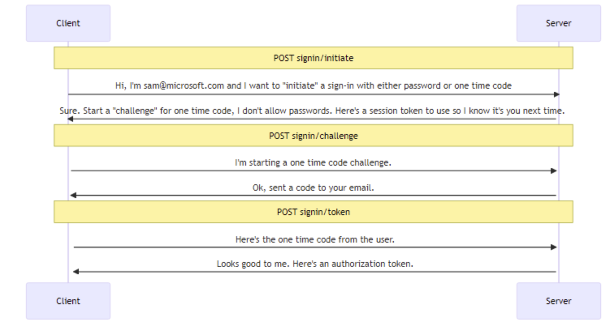
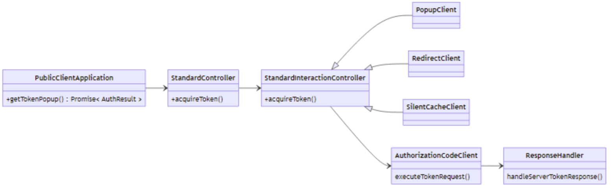
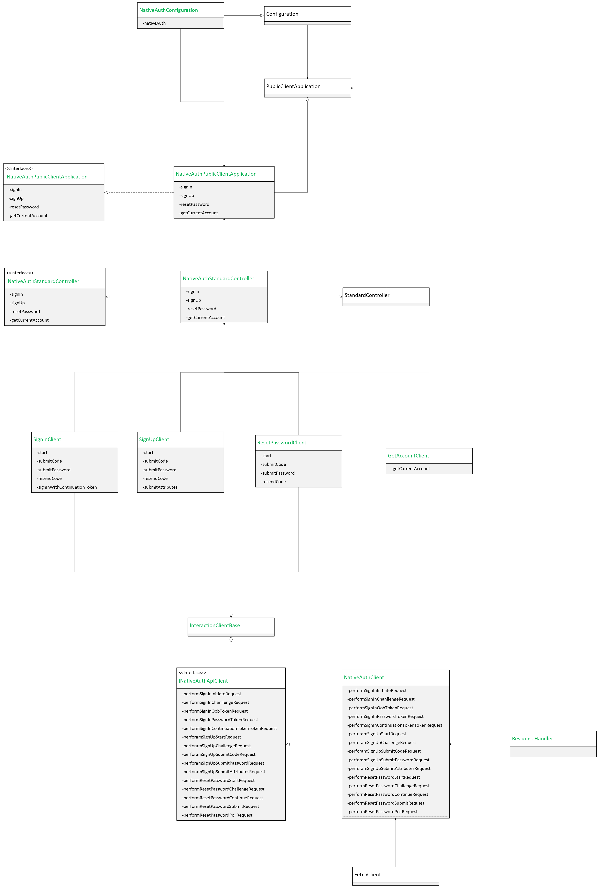
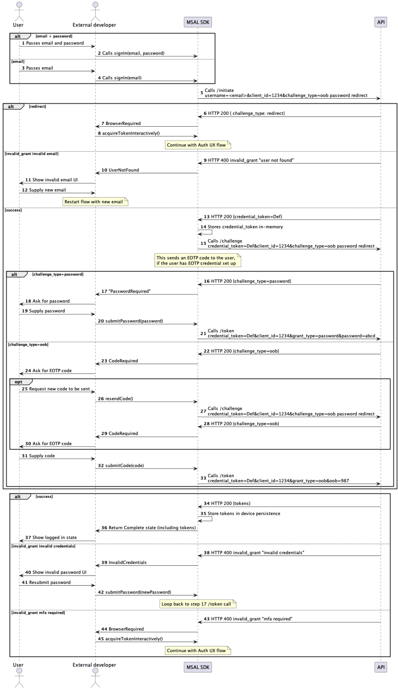
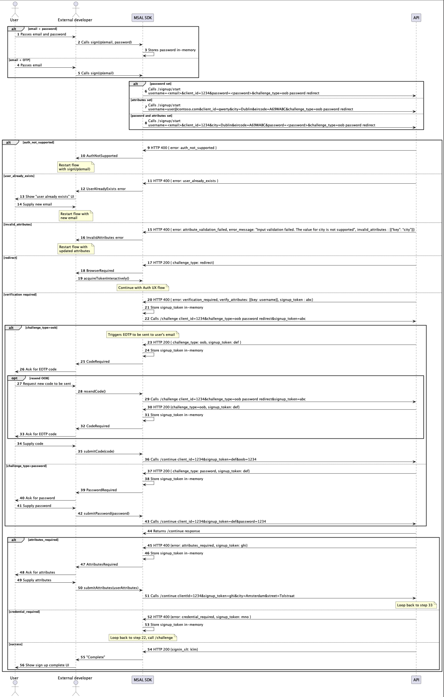
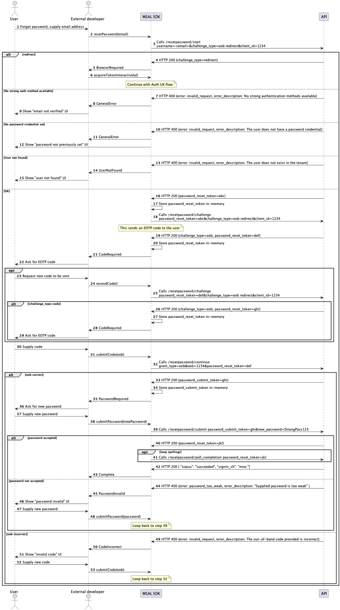

# Native Authentication for JS Technical Design

This document outlines a proposed method for integrating the Native Authentication APIs into MSAL for JavaScript. New APIs to support sign-in, sign-up, and password reset for CIAM developers that wish to control all Auth UX. It gives a brief overview of the new ESTS APIs. The architecture of MSAL for JavaScript. And finally a plan on how we could extend MSAL for JavaScript to support the new APIs.

This document's purpose is to serve as a guide for how to build/resource and scope the complete project.

The skeleton based on this design can be found [here](../src/).

## Contacts

| Role        | Name                                       |
| ----------- | ------------------------------------------ |
| Engineering | Jian Shen, Cuong Nguyen, Alban Xhaferllari |
| Product     | Kaushik Kislay                             |
| EM          | Bing Chen, Fubin Li                        |

## Project Goal

This project's core objective is to create a client for interacting with the [NativeAuthentication APIs](https://native-ux-mock-api.azurewebsites.net/doc#/) added to ESTS. These APIs offer Local Account sign-up, sign-in, and password reset features for CIAM developers to include in their applications.

We want to give CIAM developers this experience:

```sh
# In CIAM developers project dir.
# Install the native auth package to get the new CIAM features.
npm install msal-native-auth-ex
```

```javascript
// In CIAM developer's app.

// Create a global varialble "NativePublicExClientApplication".
const app = NativeAuthPublicClientApplication.create(config);

// In the SignIn Initial UI
async function handleSignIn(event) {
    const username = document.getElementById("username").value;

    const signInOptions: SignInOptions = {
        username: username,
    };

    const result = await app.signIn(signInOptions);

    // Handling the error if the action is failed
    if (!result.isSuccess) {
        // Check the error type and handle error

        if (result.error instanceof UserNotFoundError) {
            // Handle user not found error
        } else {
            // Handle unexpected error
        }

        return;
    }

    switch (result.state) {
        case SignInState.Completed:
            // read the account info from result by result.data and use it to get account data, tokens, and sign out.
            accountInfo = result.data;
            const accessToken = await accountInfo.getAccessToken();
            fetchProfile(accessToken);
            break;
        case SignInState.CodeRequired:
            navigateToCodeEntryView(result.stateHandler);
            break;
        case SignInState.PasswordRequired:
            navigateToPasswordEntryView(result.stateHandler);
            break;
        case SignInState.Failed:
            // check the error type by calling result.error and handle error
            if (result.error instanceof UserNotFoundError) {
                // Handle user not found error
            } else {
                // Handle unexpected error
            }
            break;
        default:
            throw new Error("Invalid sign in state");
    }
}

// In the Code Entry UI
async function submitCode(handler: SignInCodeRequiredStateHandler) {
    const code = document.getElementById("code").value;

    const result = handler.submitCode(code);

    switch (result.state) {
        case SignInState.Completed:
            // read the account info from result by result.data and use it to get account data, tokens, and sign out.
            break;
        case SignInState.Failed:
            // check the error type by calling result.error and handle error
            break;
        default:
            throw new Error("Invalid sign in state");
    }
}

// In the Password Entry UI
async function submitPassword(handler: SignInPasswordRequiredStateHandler) {
    const password = document.getElementById("password").value;

    const result = handler.submitPassword(password);

    switch (result.state) {
        case SignInState.Completed:
            // read the account info from result by result.data and use it to get account data, tokens, and sign out.
            break;
        case SignInState.Failed:
            // check the error type by calling result.error and handle error
            break;
        default:
            throw new Error("Invalid sign in state");
    }
}
```

## Project Features

### Scope for private preview

-   Local account: password-less authentication with email OTP (signup, signin, signout).
-   Local account: password-based authentication (signup, signin, signout).
-   Local account: SSPR with email OTP verification.
-   Retrieving token and account from cache, and refreshing token when expired.

### Out of Scope for private preview

-   Phone OTP
-   Web-fallback: eSTS capability to force a client to continue the authentication flow through a server driven (Auth UX), e.g. when a client's capabilities are deemed insufficient.
-   Social
-   MFA (can be configured in tenant, but there will not be a native solution for it)
-   Any non-CIAM tenant (native authentication is only available for CIAM tenants)
-   Broker integration

---

## Prerequisites Knowledge

Before proceeding with the technical design, it's crucial to grasp two key prerequisites:

1. A clear understanding of the service-side API that underpins this project.
2. Familiarity with the architecture of msal-for-javascript, as it forms the basis of our project.

This section of the document will provide a brief review of both prerequisites.

### Service Side API Overview

This project relies on a **new set of APIs added to ESTS to support Sign In, Sign Up & Password Reset**.

The design of these APIs is based around the ideas of the [OAuth 2.0 Direct Interaction Grant](https://aaronpk.github.io/oauth-direct-interaction-grant/draft-parecki-oauth-direct-interaction-grant.html#name-protocol-overview) protocol design (currently in draft mode).
The Microsoft API design can be found [here](https://msazure.visualstudio.com/One/_git/ESTS-Docs?path=/Protocols/NativeGrant/DevExAuthenticationAPI.md&_a=preview).

The draft protocol extends OAuth2 by adding two new endpoints (`/initiate` and `/challenge` while also amending the existing `/token` endpoint to except some new params.

**The APIs is session based and requires the caller to follow a call sequence** of `/initiate` -> loop(`/challenge`) -> `/token`. Here's a very simplified flow of the sequence:



## MSAL for JavasScript

**msal-for-javascript is the main way CIAM developers talk to the ESTS backend.** Our CIAM developers will naturally expect the above server side functionality to be support in MSAL.

<https://github.com/AzureAD/microsoft-authentication-library-for-js>

### MSAL for Javascript Tech Stack

**Language:** MSAL for Javascript is written entirely in TypeScript. TypeScript is a typed language
that compiles to JavaScript. For us, this means **we write in TypeScript and our CIAM Developers consume generated JavaScript.**

**Source Control:** Github. This means we develop in Public.

**Packaging:** NPM/CDN. When working with MSAL for JavaScript, it's important to note that it comprises multiple packages. The **primary package at the core of MSAL for JavaScript is called msal-browser**, and this is what we'll be concerned with in this document. In addition to msal-browser, there are optional packages available that wrap msal-browser and offer enhanced support for specific frameworks like React or Angular, making it easier to integrate MSAL into those environments.

### MSAL for Javascript Internals we need to know about

The diagram below illustrates the key components of MSAL for JavaScript that come into play for most public API calls. Although I've simply penciled in "getTokenPopup" in the diagram to maintain brevity, it's essential for us to comprehensively grasp this end-to-end process since we'll be adding our own classes here. This section will provide a detailed explanation of the responsibilities of each component.



#### Public Client Application

This represents the Public API, which serves as the entry point for the entire library and is what third-party developers interact with. It encompasses high-level functions such as "getToken" or "logOut."

> Well'll be expanding this interface to include our public methods for actions like Sign Up, Sign In, and more.

#### Standard Controller

This layer operates just beneath the Public API. Its primary function is to intelligently delegate public API calls to the appropriate specialized controller, based on the current state of MSAL at the time of the call. For example, if Windows Account Manager (WAM) is available, it will route calls to that component. Similarly, if there are no existing accounts available, it will transform an "acquire token" call into a "login" call. Additionally, it initiates performance profiling and emits (in a fire-and-forget manner) events that third-party developers can capture, such as LOGIN_START, LOGIN_SUCCESS, and LOGIN_FAILURE.

#### Standard Interaction Client

There are many ways to acquire tokens. Through WAM, through a popup, through redirects. And there is an interaction client for each of these. It encapsulates in an practical ad-hoc manner what is needed to authenticate through each of these.
E.g. There’s an interaction client called “PopupClient” that models the popup window we see when using msal. (add an image of this).

> We'll need to write our interaction clients that lives along side the existing ones.

#### Authorization Code Client

Each interaction client ultimately needs to talk with the ESTS OAuth endpoints to exchange an authorization code for an authentication token. This exchange process remains consistent across all interaction clients. Therefore, a common class is employed for this purpose. The primary function of this class is to communicate with the OAuth initiate and token endpoints.

> Relevance for us since all of our service-side APIs are OAuth endpoints. We'll create a similar system by implementing our custom /initiate and /challenge endpoints to align with our specific requirements.

#### Response Handler

The Authorization Code client does not retain any state information; instead, it delegates this responsibility to the response handler. Its primary function is to receive the outcome of the Authorization Code Client's operation, validate it, and subsequently update MSAL's cache and state with the newly acquired authentication code and refresh tokens. _It's worth noting that for our specific requirements, we should not need to directly interact with the lower-level MSAL cache interface._

> Important for us because we aim to provide third-party developers with the flexibility to transition between our API and the existing MSAL library. Consequently, it's crucial that we leverage this component to ensure that data is written to the MSAL cache layer correctly.

---

## Technical Spec

At a high level, considering the MSAL class diagram above, our objective is to introduce the modifications outlined in this diagram. In essence, we are extending certain existing classes with additional features and establishing a parallel call path to meet our specific requirements. Our overarching strategy is to maximize the reuse of MSAL components while minimizing disruption to existing use cases. The approach outlined here aligns fine with this strategy, as it requires only minimal adjustments to certain parts of the MSAL code.

This section of the document will provide an overview of the tasks required for each class.



### Native Auth Public Client Application

The entry point which our 3p developer will talk to.
It extends MSAL's PublicClientAPplication and adds our new functionality.

In the Service-Side section, we outline a simplified approach for third-party developers to interact with the ESTS API, addressing its inherent complexity and improving API discoverability. Our design models each stage of the authentication flow—from initiation, through challenge, to token retrieval—as distinct types, each providing a clear and intuitive API.

Notably, these functions do not immediately return an authorization token. Instead, they provide a result object, which includes any available data if the flow is complete, along with a handler for the next state if further action is required. This approach offers a user-friendly experience, enabling developers to manage each step of the authentication process effectively and minimizing potential errors.

To ensure smoother error handling, the API does not throw errors during the authentication flow. Instead, it returns an error object within the result, allowing developers to handle specific failure scenarios more easily and predictably.

```ts
export class NativeAuthPublicClientApplication
    extends PublicClientApplication
    implements INativeAuthPublicClientApplication
{
    private readonly nativeAuthController: NativeAuthStandardController;

    /*
     * Creates a new instance of a PublicClientApplication with the given configuration.
     * @param config - A configuration object for the PublicClientApplication instance
     */
    static create(
        config: NativeAuthConfiguration
    ): NativeAuthPublicClientApplication {
        return new NativeAuthPublicClientApplication(config);
    }

    /*
     * Creates a new instance of a PublicClientApplication with the given configuration and controller.
     * @param config - A configuration object for the PublicClientApplication instance
     * @param controller - A controller object for the PublicClientApplication instance
     */
    constructor(
        config: NativeAuthConfiguration,
        controller?: INativeAuthStardardController
    ) {
        const nativeAuthController = new NativeAuthStandardController(
            new NativeAuthOperatingContext(config)
        );

        super(config, controller || nativeAuthController);

        this.nativeAuthController = nativeAuthController;
    }

    /*
     * Gets the current account from the cache.
     * @param getAccountOptions - Options for getting the current cached account
     * @returns - A promise that resolves to GetAccountResult
     */
    getCurrentAccount(
        getAccountOptions: GetAccountOptions
    ): Promise<GetAccountResult> {}

    /*
     * Initiates the sign-in flow.
     * @param signInOptions - Options for the sign-in flow
     * @returns - A promise that resolves to SignInResult
     */
    signIn(signInOptions: SignInOptions): Promise<SignInResult> {}

    /*
     * Initiates the sign-up flow.
     * @param signUpOptions - Options for the sign-up flow
     * @returns - A promise that resolves to SignUpResult
     */
    signUp(signUpOptions: SignUpOptions): Promise<SignUpResult> {}

    /*
     * Initiates the reset password flow.
     * @param resetPasswordOptions - Options for the reset password flow
     * @returns - A promise that resolves to ResetPasswordStartResult
     */
    resetPassword(
        resetPasswordOptions: ResetPasswordOptions
    ): Promise<ResetPasswordStartResult> {}
}
```

#### SignIn Result Types and Involved State Handlers

```ts
/*
 * Result of a sign-in operation.
 */
export class SignInResult extends ResultBase<
    AccountInfo,
    SignInCodeRequiredHandler | SignInPasswordRequiredHandler
> {}

/*
 * Result of a sign-in operation that requires a code.
 */
export class SignInSubmitCodeResult extends ResultBase<AccountInfo> {
    constructor(resultData?: AccountInfo) {
        super(resultData);
    }
}

/*
 * Result of a sign-in operation that requires a password.
 */
export class SignInSubmitPasswordResult extends ResultBase<AccountInfo> {
    constructor(resultData?: AccountInfo) {
        super(resultData);
    }
}

/*
 * Result of resending code in a sign-in operation.
 */
export class SignInResendCodeResult extends ResultBase<
    void,
    SignInCodeRequiredHandler
> {
    constructor(nextStateHandler?: SignInCodeRequiredHandler) {
        super(undefined, nextStateHandler);
    }
}

/*
 * Base handler for sign-in operations.
 */
abstract class SignInHandler extends HandlerBase {
    /*
     * Constructor for SignInHandler.
     * @param signInClient - The client to use for sign-in operations.
     * @param correlationId - The correlation ID for the request.
     * @param continuationToken - The continuation token for the sign-in operation.
     * @param config - The configuration for the client.
     * @param scopes - The scopes to request during sign-in.
     */
    constructor(
        protected signInClient: SigninClient,
        correlationId: string,
        continuationToken: string,
        protected config: NativeAuthConfiguration,
        protected scopes?: Array<string>
    ) {}
}

/*
 * Handler for sign-in operations that require a code.
 */
export class SignInCodeRequiredHandler extends SignInHandler {
    /*
     * Submits a code for sign-in.
     * @param code - The code to submit.
     * @returns The result of the operation.
     */
    async submitCode(code: string): Promise<SignInSubmitCodeResult> {}

    /*
     * Resends a code for sign-in.
     * @returns The result of the operation.
     */
    async resendCode(): Promise<SignInResendCodeResult> {}
}

/*
 * Handler for sign-in operations that require a password.
 */
export class SignInPasswordRequiredHandler extends SignInHandler {
    /*
     * Submits a password for sign-in.
     * @param password - The password to submit.
     * @returns The result of the operation.
     */
    async sumbmitPassword(
        password: string
    ): Promise<SignInSubmitPasswordResult> {}
}

/*
 * Handler for sign-in operations that require a continuation token.
 */
export class SignInContinuationHandler extends HandlerBase {
    /*
     * Constructor for SignInContinuationHandler.
     * @param correlationId - The correlation ID for the request.
     * @param continuationToken - The continuation token for the sign-in operation.
     * @param config - The configuration for the client.
     * @param username - The username for the sign-in operation.
     */
    constructor(
        correlationId: string,
        continuationToken: string,
        private config: NativeAuthConfiguration,
        private username: string
    ) {}

    /*
     * Initiates the sign-in flow with continuation token.
     * @param scopes - The scopes to request during sign-in.
     * @returns The result of the operation.
     */
    signIn(scopes?: Array<string>): Promise<SignInResult> {}
}
```

#### SignUp Result Types and Involved State Handlers

```ts
/*
 * Result of a sign-up operation.
 */
export class SignUpResult extends ResultBase<
    void,
    | SignUpCodeRequiredHandler
    | SignUpPasswordRequiredHandler
    | SignUpAttributesRequiredHandler
    | SignInContinuationHandler
> {
    isFlowCompleted(): boolean {
        return this.nextStateHandler instanceof SignInContinuationHandler;
    }
}

/*
 * Result of a sign-up operation that requires a code.
 */
export class SignUpSubmitCodeResult extends SignUpResult {}

/*
 * Result of a sign-up operation that requires a password.
 */
export class SignUpSubmitPasswordResult extends SignUpResult {}

/*
 * Result of a sign-up operation that requires attributes.
 */
export class SignUpSubmitAttributesResult extends SignUpResult {}

/*
 * Result of resending code in a sign-up operation.
 */
export class SignUpResendCodeResult extends ResultBase<
    void,
    SignUpCodeRequiredHandler
> {}

/*
 * Base handler for sign-up flow.
 */
abstract class SignUpHandler extends HandlerBase {
    /*
     * Creates a new SignUpHandler.
     * @param correlationId - The correlation ID for the request.
     * @param continuationToken - The continuation token for the request.
     * @param config - The configuration for the request.
     * @param username - The username for the request.
     */
    constructor(
        correlationId: string,
        continuationToken: string,
        protected config: NativeAuthConfiguration,
        protected username: string
    ) {}
}

/*
 * Handler for sign-up operations that require a code.
 */
export class SignUpCodeRequiredHandler extends SignUpHandler {
    /*
     * Submits a code for sign-up.
     * @param code - The code to submit.
     * @returns The result of the operation.
     */
    submitCode(code: string): Promise<SignUpSubmitCodeResult> {}

    /*
     * Resends a code for sign-up.
     * @returns The result of the operation.
     */
    resendCode(): Promise<SignUpResendCodeResult> {}
}

/*
 * Handler for sign-up operations that require a password.
 */
export class SignUpPasswordRequiredHandler extends SignUpHandler {
    /*
     * Submits a password for sign-up.
     * @param password - The password to submit.
     * @returns The result of the operation.
     */
    sumbmitPassword(password: string): Promise<SignUpSubmitPasswordResult> {}
}

/*
 * Handler for sign-up operations that require attributes.
 */
export class SignUpAttributesRequiredHandler extends SignUpHandler {
    /*
     * Submits attributes for sign-up.
     * @param attributes - The attributes to submit.
     * @returns The result of the operation.
     */
    sumbmitAttributes(
        attributes: UserAccountAttributes
    ): Promise<SignUpSubmitAttributesResult> {}
}
```

#### Reset Password Result Types and Involved State Handlers

```ts
/*
 * Result of a reset password operation.
 */
export class ResetPasswordStartResult extends ResultBase<
    void,
    ResetPasswordCodeRequiredHandler
> {}

/*
 * Result of a reset password operation that requires a code.
 */
export class ResetPasswordSubmitCodeResult extends ResultBase<
    void,
    ResetPasswordPasswordRequiredHandler
> {}

/*
 * Result of a reset password operation that requires a password.
 */
export class ResetPasswordSubmitPasswordResult extends ResultBase<
    void,
    SignInContinuationHandler
> {
    /*
     * Checks if the flow is completed.
     * @returns True if the flow is completed, false otherwise.
     */
    isFlowCompleted(): boolean {
        return true;
    }
}

/*
 * Result of resending code in a reset password operation.
 */
export class ResetPasswordResendCodeResult extends ResultBase<
    void,
    ResetPasswordCodeRequiredHandler
> {}

/*
 * Base handler for reset password operation.
 */
abstract class ResetPasswordHandler extends HandlerBase {
    /*
     * Creates a new handler for reset password operation.
     * @param correlationId - The correlationId for the request.
     * @param continuationToken - The continuation token for the request.
     * @param config - The configuration for the request.
     * @param username - The username for the request.
     */
    constructor(
        correlationId: string,
        continuationToken: string,
        protected config: NativeAuthConfiguration,
        protected username: string
    ) {}
}

/*
 * Handler for reset password operations that require a code.
 */
export class ResetPasswordCodeRequiredHandler extends ResetPasswordHandler {
    /*
     * Submits a code for reset password.
     * @param code - The code to submit.
     * @returns The result of the operation.
     */
    submitCode(code: string): Promise<ResetPasswordSubmitCodeResult> {}

    /*
     * Resends a code for reset password.
     * @returns The result of the operation.
     */
    resendCode(): Promise<ResetPasswordResendCodeResult> {}
}

/*
 * Handler for reset password operations that require a password.
 */
export class ResetPasswordPasswordRequiredHandler extends ResetPasswordHandler {
    /*
     * Submits a password for reset password.
     * @param password - The password to submit.
     * @returns The result of the operation.
     */
    sumbmitPassword(
        password: string
    ): Promise<ResetPasswordSubmitPasswordResult> {}
}
```

#### Get Current Account Result Types and Involved State Handlers

```ts
/*
 * Result of getting an account.
 */
export class GetAccountResult extends ResultBase<AccountInfo> {}

/*
 * Account information.
 */
export class AccountInfo {
    /*
     * Constructor
     * @param account - Account data
     * @param correlationId - Correlation id
     * @param config - Configuration
     */
    constructor(
        private readonly account: AccountData,
        private readonly correlationId: string,
        private readonly config: NativeAuthConfiguration
    ) {}

    /*
     * Signs the current user out
     * @returns The result of the operation.
     */
    signOut(): Promise<SignOutResult> {}

    /*
     * Gets the account data.
     * @returns The account data.
     */
    getAccount(): AccountData {}

    /*
     * Gets the account id-token.
     * @returns The account id-token.
     */
    getIdToken(): string | undefined {}

    /*
     * Gets the token claims.
     * @returns The token claims.
     */
    getClaims():
        | (TokenClaims & {
              [key: string]:
                  | string
                  | number
                  | string[]
                  | object
                  | undefined
                  | unknown;
          })
        | undefined {}

    /*
     * Gets the access token from cache.
     * @param forceRefresh - Force a token refresh
     * @param scopes - The scopes to request
     * @returns The result of the operation.
     */
    getAccessToken(
        forceRefresh: boolean = false,
        scopes?: Array<string>
    ): Promise<GetAccessTokenResult> {}
}

/*
 * Result of getting an access token.
 */
export class GetAccessTokenResult extends ResultBase<AuthenticationResult> {}

/*
 * Result of a sign-out operation.
 */
export class SignOutResult extends ResultBase<void, void> {
    /*
     * Checks if the flow is completed.
     * @returns True if the flow is completed, false otherwise.
     */
    isFlowCompleted(): boolean {
        return true;
    }
}
```

#### Native Auth Standard Controller

Our controller layer will sit directly beneath the public interface, much like MSAL’s StandardController. In addition to the standard functions, it will also include our extended functionality. Through the controller, we can access essential components for logging, browser caching, and more.

#### Native Auth Interaction Clients

These classes will function as the core layer responsible for interacting directly with the Native Auth endpoints. Each client class will focus on constructing and returning specific action result objects, which the controller will then use to generate authentication flow results for third-party developers. The clients may include classes such as SignInClient, SignUpClient, ResetPasswordClient, and GetAccountClient.

#### Native Auth API Client

The Native Auth API Client functions as the network layer for connecting with Native Auth endpoints. Each request handler within this client returns responses that the Interaction Client uses to generate action results for the controller.

##### Sign in Sequence



##### Sign up Sequence



##### Self Service Password Reset Sequence



---

## Packaging

We will distribute the package by using NPM and MSAL for Javascript CDN.

We have two choices for where to package this work that each have their pros and cons.

### Option 1: Inside of MSAL-browser

#### Folder Structure

-   root
    -   lib
        -   msal-browser
            -   src
                -   `native-auth`
        -   msal-common
        -   msal-angular
        -   msal-react

#### Pros

-   Maximum leverage of existing implementations of MSAL for JS, including PublicClientApplication initialization, build pipelines, caching, token refresh logic, web-fallback, logging, telemetry, error-handling, network clients, etc.
-   Reduces the need to duplicate common functionality, allowing us to focus on implementing Native Authentication-specific features.
-   Potentially easier for 3rd party developers to adopt the new changes.
-   This approach aligns with how Native Authentication for CIAM features are implemented on iOS and Android versions of MSAL SDKs, where the features are integrated directly into the core MSAL libraries. This consistency across platforms helps ensure better alignment and maintainability across the different MSAL SDKs.

#### Cons

-   Integrating Native Authentication for CIAM codes into the msal-browser package will result in an increase in its size. This could potentially affect the loading times or the overall bundling size for our SDK customers.
-   Potentially higher complexity in maintaining a larger package, such as ICM tickets, bug fixes, and contribution guidelines.
-   Introduces a risk of bugs in existing MASL use case.

### Option 2: Create a New Package (e.g., msal-native-auth-ex)

With this approach, the Native Authentication for CIAM functionality would be encapsulated within its own package (e.g., msal-native-auth), and would include msal-browser as a dependency. This approach limits us to only utilizing the features that msal-browser makes publicly available, along with any functionalities that can be leveraged from msal-common.

#### Folder Structure

-   root
    -   lib
        -   msal-browser
        -   msal-common
        -   msal-angular
        -   msal-react
        -   `native-auth`

#### Pros

-   Minimal impact on the msal-browser package, keeping it lightweight for current customers.
-   Easier maintenance, as msal-native-auth would be isolated and developed as a standalone package.

#### Cons

-   Increased cost in terms of development effort, as we would need to reimplement certain features (e.g., controller, caching manager, and HTTP client) that exist in msal-browser unless MSAL for JS team could consider exposing these required features (make them public or add into common package), reducing rework but requiring changes to msal-browser.
-   Introduces additional package for 3rd party developers to understand.

### Final Choice

After discussing with the MSAL for JS team, we have agreed on Option 2 as the best choice, as it will have minimal impact on the existing msal-browser package. The MSAL team also confirmed that they will expose the features we need to leverage from the msal-browser package.

## Telemetry

MSAL for JavaScript has a ton of instrumentation and profiling built in we can reuse.

The effort needed here will be to negotiate with MSAL how we isolate this projects telemetry.

## Privacy

The privacy review can use MSAL for javascript privacy as a starter template.

<https://global.azure.com/privacymanager/service/75ae2111-85e0-4898-922d-c242db4a92af/review/HistoryTab>

It should be discussed with msal-for-javascript if they want this privacy review done in their org.

## Testing strategy

E2E tests should be in parity with the Android/iOS Native Auth stuff: <https://microsofteur.sharepoint.com/:x:/t/DevExDublin/ESLT-SpZO7dEpuN4aLIiB9MBMPeJ94oJWIy8vFEa4Jsimg?e=duxfum>.

## Technical Blockers

In the [original tech spec](https://identitydivision.visualstudio.com/Engineering/_git/devexdub-docs/pullrequest/9969?_a=files&path=%2FCIAM%2FSDK%2Fjs%2Fjs.md), it mentions some technical blockers on the service side that would need to be addressed before we could do a first release.

### 1. CORS Issues with Newly Added APIs

The one major techincal blocker is that the newly added APIs added to ESTS discussed before do not respect the SPA
registration and all calls will fail over CORs issues. You'll see the POC patch worked around this by proxying all
requests through a server that stripped origin headers.

> As a temporary solution, the team will implement a proxy workaround to unblock developers from the CORS issue. For the long-term solution, the service team will resolve the issue within the service.

### 2. Incorrect Endpoints in OpenID Configuration

The second blocker (that could be hacked and worked around) is that the OpenID config doesn't return the correct
endpoints needed for the newly added ESTS APIs. You'll see the POC patch works around this by hardcoding the new endpoints in places.

> This need to be confirmed.

### 3. MSAL for Javascript already has a set of classed named "NativeAuthentication"

MSAL-Browser considers talking wo WAM NativeAuthentication. We need to name our stuff differently internally.

> We need to find a new pattern to name our classes in the MSAL for JS repo (e.g., NativeAuthEx).
